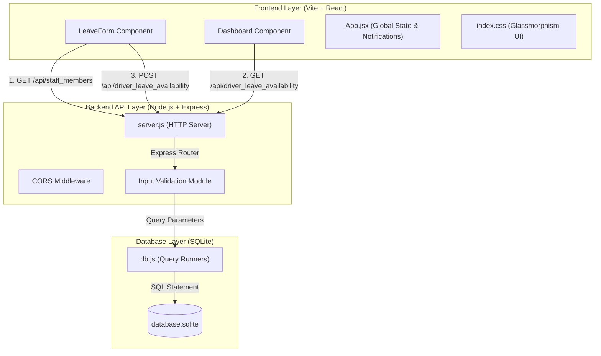

# Driver Leave & Availability Tracker

A professional, decoupled 3-tier web application designed for fleet operations to track, manage, and optimize driver leaves and real-time availability. The system enables dispatchers to search driver registries, log leave schedules, run automated scheduling validations (such as overlapping date checks), soft-cancel leave records, export logs as CSV, and audit administrative actions in real time.

---

## 🚀 Key Features

- **📊 Centralized KPI Dashboard**: Displays 8 real-time operational statistics:
  - *Total Drivers*, *Active Drivers*, *Drivers on Leave (Active Today)*, *Pending Requests*, *Approved Requests*, *Rejected Requests*, *Total Leaves Logged*, and *Driver Availability Rate (%)*.
- **🚗 Driver Profile Registry**: Add, update, search, and manage driver profiles, including licensing information (DLs) and vehicle preferences (e.g., Sedan, SUV, Tempo Traveller).
- **📅 Leave Request Intake Form**: An interactive form for dispatchers to log leaves with automatic validations preventing overlapping requests for the same driver.
- **⚡ Administrative Controls**: Approve, reject, edit, or soft-cancel leaves. Cancelled requests immediately free up driver availability while preserving historical records.
- **📁 Data Exporting (CSV)**: Export both driver profiles and leave history logs into standard RFC-4180 CSV formats for external analytics or spreadsheets.
- **🔍 Real-Time Search & Filtering**: Fast, client-side text filtering across driver names, licenses, vehicle categories, and leave reasons.
- **📝 Audit Logging**: Every registry update, leave creation, status change, and validation error is automatically logged in the database audit table for compliance.

---

## 🛠️ Technology Stack

- **Frontend (Presentation Layer)**:
  - React (v18) & Vite (for instantaneous compilation and updates)
  - Vanilla CSS (custom design system, HSL colors, responsive tables, and glassmorphism styling)
- **Backend (Application/API Layer)**:
  - Node.js & Express
  - Custom validator middlewares and database transaction error handlers
- **Database (Data Storage Layer)**:
  - SQLite (stored in a local zero-configuration database file `database.sqlite` inside the `backend` folder)
  - Programmatic foreign key constraints and composite indices for performance optimization

---

## 📐 System Architecture & Data Flow

The project is structured strictly as a decoupled **3-Tier Architecture**:



---

## 📂 Project Structure

```text
├── backend/
│   ├── db.js                 # SQLite connection, tables schema, and initial seeding
│   ├── package.json          # Node dependencies (express, sqlite3, dotenv, cors)
│   ├── server.js             # REST API server endpoints & business logic validations
│   └── database.sqlite       # Local SQLite database file (automatically created)
├── frontend/
│   ├── index.html            # Entry HTML document
│   ├── vite.config.js        # Vite compilation & port (3000) settings
│   ├── package.json          # Frontend build configuration and packages
│   └── src/
│       ├── main.jsx          # DOM entry renderer
│       ├── index.css         # Custom CSS variables, components, & dark mode styling
│       ├── App.jsx           # Global state manager, summary KPIs, tabs, & routing
│       └── components/
│           ├── LeaveForm.jsx # Validation form for submitting leave requests
│           ├── Dashboard.jsx # Grid of leaves, status updates, edit modal, and actions
│           └── DriverManagement.jsx # Driver profile editor, lookup, and list
├── docs/                     # Architectural documents, review preparations, & surveys
├── tests/                    # Postman API test collection files
├── .gitignore                # Production ignore patterns (.env, databases, node_modules, OS files)
└── package.json              # Workspace runner script configuration
```

---

## ⚡ Setup & Run Instructions

To download packages and run both the frontend and backend servers together, use the following simple commands in the project root:

### 1. Install Dependencies
Run this in the root directory to install all backend and frontend dependencies automatically:
```bash
npm run install:all
```

### 2. Run in Development Mode
To launch the backend API server (on port `5000`) and the Vite React frontend (on port `3000`) concurrently:
```bash
npm run dev
```
Once run, navigate to **`http://localhost:3000`** in your browser.

---

## 🗄️ Database Schema Design

The SQLite relational schema comprises three tables:

### 1. `staff_members` (Driver Profiles)
- `id`: `INTEGER PRIMARY KEY AUTOINCREMENT`
- `Drivers`: `TEXT UNIQUE NOT NULL` (Driver's full name)
- `planned`: `TEXT` (Driver's License Number)
- `leaves`: `TEXT` (Preferred vehicle category, e.g., Sedan/SUV)
- `status`: `TEXT` (Defaults to `'Active'`; can be set to `'Inactive'`)

### 2. `driver_leave_availability` (Leave Records)
- `id`: `INTEGER PRIMARY KEY AUTOINCREMENT`
- `Drivers`: `TEXT NOT NULL` (References `staff_members.Drivers` via Foreign Key)
- `planned`: `DATETIME NOT NULL` (Leave Start Date & Time)
- `leaves`: `DATETIME NOT NULL` (Leave End Date & Time)
- `status`: `TEXT` (Defaults to `'Pending'`; can be `'Approved'`, `'Rejected'`, or `'Cancelled'`)
- `unavailability`: `TEXT` (Reason for leave)
- `admin`: `TEXT` (Admin comments or remarks)

### 3. `audit_logs` (History trail)
- `id`: `INTEGER PRIMARY KEY AUTOINCREMENT`
- `Drivers`: `TEXT NOT NULL` (Driver/Target name or `'System'`)
- `planned`: `TEXT NOT NULL` (Action type, e.g., `'Leave Created'`, `'Driver Deactivated'`)
- `leaves`: `TEXT` (Detailed log message description)
- `status`: `TEXT DEFAULT 'Info'` (Log level, e.g., `'Info'`, `'Conflict'`, `'DB Init'`)

---

## 🔌 API Endpoints Reference

| Method | Endpoint | Description |
| :--- | :--- | :--- |
| **GET** | `/api/health` | Service health status check |
| **GET** | `/api/staff_members` | Retrieve list of all registered drivers |
| **POST** | `/api/staff_members` | Create a new driver profile (names must be unique) |
| **PUT** | `/api/staff_members/:id` | Update driver profile details (license, vehicle, active status) |
| **DELETE**| `/api/staff_members/:id` | Soft-deactivates profile if leave history exists, else permanently deletes |
| **GET** | `/api/staff_members/export` | Downloads the entire driver registry as a CSV file |
| **GET** | `/api/driver_leave_availability` | Fetch all leave records in reverse chronological order |
| **POST** | `/api/driver_leave_availability` | Log a leave request (performs driver check and overlap checks) |
| **PUT** | `/api/driver_leave_availability/:id` | Edit details of an existing leave request (resets status to `Pending`) |
| **PUT** | `/api/driver_leave_availability/:id/approve` | Set leave status to `Approved` |
| **PUT** | `/api/driver_leave_availability/:id/reject` | Set leave status to `Rejected` |
| **DELETE**| `/api/driver_leave_availability/:id` | Soft-cancel a leave request (sets status to `Cancelled`) |
| **GET** | `/api/driver_leave_availability/export` | Downloads all leave tracking records as a CSV file |

---

## 🧪 Testing

A Postman API collection is provided at `tests/Driver_Leave_Calendar_API_Tests.postman_collection.json`. 

You can import this collection into Postman to run automated request validations, including testing for:
1. Valid health checks.
2. Valid driver list retrievals.
3. Rejecting leave submissions with overlapping times (date conflicts).
4. Rejecting leaves with ending dates preceding start dates.
5. Rejecting inputs matching unregistered/inactive drivers.
