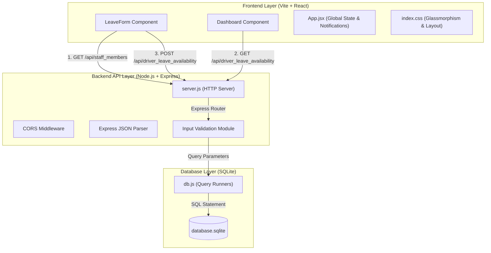
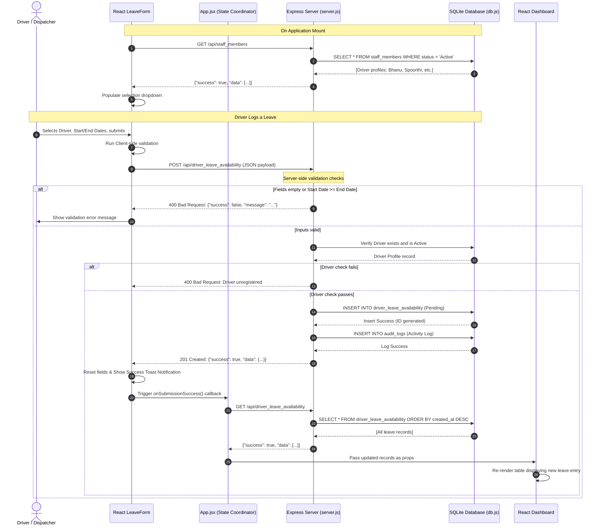
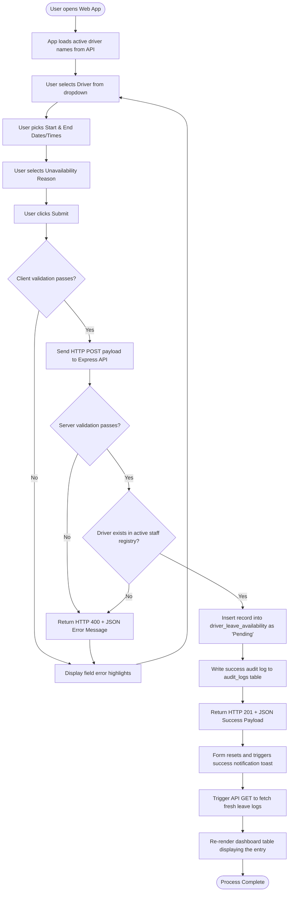

# System Architecture & User Flow Diagrams

This document contains the structural system architecture, sequence models, and operational user flow diagrams for the **Driver Leave & Availability Calendar** application.

---

## 1. 3-Tier System Architecture Diagram

The application is structured as a decoupled 3-tier web architecture. The client-side interface communicates asynchronously with the backend server, which executes database operations using parameterized queries.

---

## 2. API Request Sequence Diagram

This diagram details the chronological sequence of requests, data validations, database transactions, and state synchronizations occurring when a driver submits a leave request.

---

## 3. Operational User Flow Diagram

This flow diagram charts the path from the user's perspective, representing the logical steps from profile selection to dashboard feedback.

