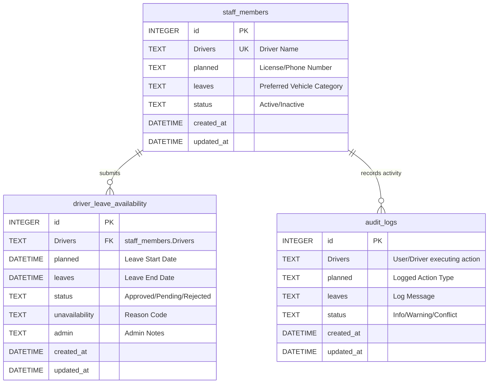

# Database Design & Entity Relationship Diagram

This chapter details the relational database design for the **Driver Leave & Availability Calendar** project. It specifies the table schemas, field constraints, relationships, and includes a visual Entity-Relationship (ER) diagram using Mermaid syntax.

---

## 1. Relational Database Schema Mappings

To fulfill the specific academic constraints of the project guidelines, the primary database entities use the required column names: `id`, `Drivers`, `planned`, `leaves`, `status`, `unavailability`, and `admin`.

### Table 1: `staff_members`
Stores driver profiles, metadata, and default preferences.
* **id**: INTEGER (Primary Key, Auto-increment) - Unique identifier for the staff profile.
* **Drivers**: TEXT (Unique, Not Null) - The driver's full name. Acts as the primary logical key for relationships.
* **planned**: TEXT - Driver's license number or phone number.
* **leaves**: TEXT - Driver's preferred vehicle category (e.g., `Sedan`, `SUV`, `Tempo Traveller`).
* **status**: TEXT - Registration status: `Active` or `Inactive`.
* **created_at**: DATETIME - Timestamp when the driver profile was created.
* **updated_at**: DATETIME - Timestamp when the profile was last modified.

### Table 2: `driver_leave_availability`
Logs the driver's leave requests and periods of unavailability.
* **id**: INTEGER (Primary Key, Auto-increment) - Unique identifier for the leave record.
* **Drivers**: TEXT (Not Null) - Driver's name, referencing `staff_members.Drivers` (Foreign Key).
* **planned**: DATETIME (Not Null) - The planned start date & time of the leave.
* **leaves**: DATETIME (Not Null) - The end date & time of the leave.
* **status**: TEXT - Approval status: `Pending`, `Approved`, or `Rejected`.
* **unavailability**: TEXT - Reason code for leave (e.g., `Personal Leave`, `Medical Leave`, `Vehicle Maintenance`).
* **admin**: TEXT - Admin reviewer comments or name of the approving administrator.
* **created_at**: DATETIME - Timestamp when the leave request was submitted.
* **updated_at**: DATETIME - Timestamp when the request was last updated.

### Table 3: `audit_logs`
System audit log to record status changes, validation events, and actions.
* **id**: INTEGER (Primary Key, Auto-increment) - Unique log index.
* **Drivers**: TEXT (Not Null) - Name of the user or driver associated with the logged action.
* **planned**: TEXT (Not Null) - The action type executed (e.g., `Insert Leave`, `Update Status`, `Validation Error`).
* **leaves**: TEXT - Detailed description message of the system event.
* **status**: TEXT - Severity level: `Info`, `Warning`, `Conflict`.
* **created_at**: DATETIME - Timestamp of the event log.
* **updated_at**: DATETIME - Timestamp when the log was recorded.

---

## 2. Entity-Relationship (ER) Diagram

The relationships between the tables are detailed below.
* A single driver in `staff_members` can log multiple leave request entries in `driver_leave_availability` (1-to-Many relationship).
* A single driver profile in `staff_members` can be associated with multiple entries in `audit_logs` (1-to-Many relationship).

---

## 3. Data Integrity & Validation Rules

* **Foreign Key Constraints**: The database enforces that any name inserted into `driver_leave_availability(Drivers)` must exist in the `staff_members(Drivers)` table.
* **Index Optimizations**: To support rapid dashboard filtering and matching calculations, the database utilizes index optimizations on:
  - `driver_leave_availability(Drivers)`
  - `driver_leave_availability(planned, leaves)` (Composite index to accelerate range queries for overlaps)
